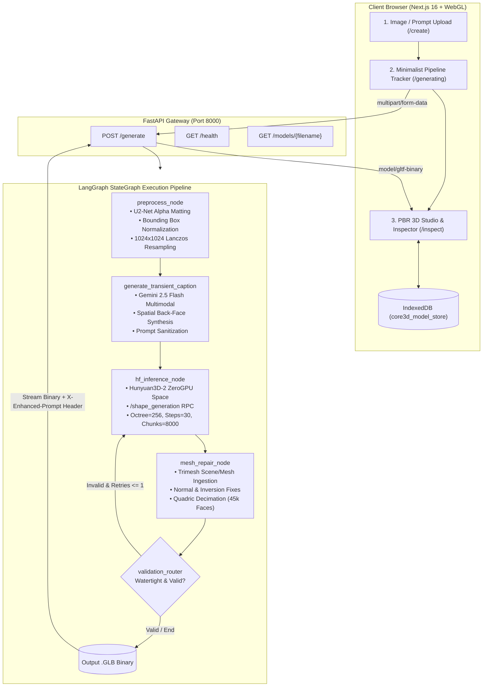

# Core3D — Generative 2D-to-3D Neural Mesh Synthesis & WebGL Inspection Studio

[](https://nextjs.org/)
[](https://react.dev/)
[](https://fastapi.tiangolo.com/)
[](https://github.com/langchain-ai/langgraph)
[](https://huggingface.co/spaces/tencent/Hunyuan3D-2)
[](https://trimesh.org/)
[](LICENSE)

An asynchronous, production-grade generative pipeline and interactive WebGL studio that transforms single-view 2D reference images into watertight, manifold 3D polygonal meshes (`.GLB`) in under 30 seconds.

---

## 📑 Table of Contents

1. [System Architecture](#-system-architecture)
2. [LangGraph State Machine Pipeline](#-langgraph-state-machine-pipeline)
3. [Algorithmic Deep-Dive](#-algorithmic-deep-dive)
4. [Technology Stack](#-technology-stack)
5. [REST API Reference](#-rest-api-reference)
6. [Frontend & WebGL Studio](#-frontend--webgl-studio)
7. [Environment Configuration](#-environment-configuration)
8. [Installation & Local Setup](#-installation--local-setup)
9. [Production Deployment & Containerization](#-production-deployment--containerization)
10. [Performance & Latency Benchmarks](#-performance--latency-benchmarks)
11. [Repository Structure](#-repository-structure)
12. [Troubleshooting & Gotchas](#-troubleshooting--gotchas)

---

## 🏛️ System Architecture

Core3D operates on a decoupled client-server architecture:
- **Asynchronous Execution Backend:** Python FastAPI orchestrates a compiled **LangGraph `StateGraph`** state machine, integrating U2-Net segmentation, Google Gemini multimodal prompt synthesis, remote ZeroGPU flow-matching inference, and Trimesh topology repair.
- **Client Application & 3D Studio:** Next.js 16 (App Router + Turbopack) delivers an ultra-minimalist CAD interface powered by Google `<model-viewer>` for real-time PBR material shader adjustments and browser-level IndexedDB persistence.



---

## ⚙️ LangGraph State Machine Pipeline

The backend models generation as a discrete state machine defined with `langgraph.graph.StateGraph`.

### State Schema (`MeshState`)

```python
class MeshState(TypedDict):
    job_id: str                      # Unique 8-character execution identifier
    input_image_path: str            # Local path to uploaded raw image
    preprocessed_path: Optional[str] # Path to 1024x1024 RGBA normalized PNG
    user_prompt: Optional[str]       # Optional user text description
    enhanced_prompt: Optional[str]   # Synthesized Gemini multimodal caption
    raw_mesh_path: Optional[str]     # Raw GLB retrieved from inference worker
    final_mesh_path: Optional[str]   # Validated and repaired GLB binary
    face_count: int                  # Final polygon triangle count
    is_valid: bool                   # Geometric manifold validity flag
    retry_count: int                 # Current retry attempt counter
    max_retries: int                 # Upper retry threshold (default: 1)
```

### Graph Node Flow

1. **`preprocess` (`preprocess_node`):**
   - Ingests raw user image from disk.
   - Computes alpha matte with `rembg` (U2-Net).
   - Extracts subject bounding box and normalizes to a square canvas with a **15% uniform border margin**.
   - Resamples to **`1024 × 1024` RGBA** using Lanczos-4 interpolation.

2. **`generate` (`hf_inference_node`):**
   - Invokes `generate_transient_caption()` via Google Gemini 2.5 Flash to synthesize a back-face geometric descriptor.
   - Dispatches remote ZeroGPU RPC prediction via `gradio_client.Client` targeting `tencent/Hunyuan3D-2` (`/shape_generation`).
   - Copies generated `.glb` payload to `.workspace/outputs/{job_id}_raw.glb`.

3. **`repair` (`mesh_repair_node`):**
   - Parses geometry via `trimesh.load()`.
   - Distinguishes between textured `trimesh.Scene` and raw `trimesh.Trimesh` geometry.
   - Executes topological manifold repair (normals, boundary holes, quadric decimation if $> 45,000$ triangles).
   - Validates face counts ($\ge 2000$ polygons and non-zero vertex count).

4. **`validation_router` (Conditional Edge):**
   - Routes to `generate` if `is_valid == False` and `retry_count <= max_retries`.
   - Routes to `END` on successful generation or retry exhaustion.

---

## 🔬 Algorithmic Deep-Dive

### 1. Subject Isolation & Alpha Normalization

Neural 3D shape reconstruction models exhibit high sensitivity to background clutter and subject placement. The preprocessing stage standardizes the spatial coordinate space:

$$\text{Margin Padding Factor} = 1.15 \times \max(\text{width}_{\text{subject}}, \text{height}_{\text{subject}})$$

$$\text{Offset}_{x} = \frac{\text{dim}_{\text{canvas}} - \text{width}_{\text{subject}}}{2}, \quad \text{Offset}_{y} = \frac{\text{dim}_{\text{canvas}} - \text{height}_{\text{subject}}}{2}$$

```python
# Extract alpha bounding box
alpha = np.array(nobg.split()[-1])
bbox = Image.fromarray(alpha).getbbox()
if bbox:
    nobg = nobg.crop(bbox)

# Re-center onto square canvas with 15% uniform margin
dim = int(max(nobg.size) * 1.15)
canvas = Image.new("RGBA", (dim, dim), (0, 0, 0, 0))
canvas.paste(nobg, ((dim - nobg.size[0]) // 2, (dim - nobg.size[1]) // 2))
padded = canvas.resize((1024, 1024), Image.Resampling.LANCZOS)
```

### 2. Transient Multimodal Geometric Conditioning

Single 2D images suffer from occlusion (the "back-face hallucination" problem). Gemini 2.5 Flash is conditioned with a zero-shot prompt engineered to synthesize spatial back-face topology and structural volume:

```
Analyze the image alongside this description and generate an enhanced, concise 3D reconstruction caption
(under 40 words). Emphasize 3D volume, unseen back-face geometry, structure, and surface finish.
Return only the caption with no filler or prefixes.
```

The response parser extracts clean text tokens across string, list-of-dict (`[{'type': 'text', 'text': ...}]`), and raw string representations, eliminating SDK signature leaks.

### 3. Remote Volumetric Flow Matching Inference

Inference connects to the **Tencent Hunyuan3D-2** ZeroGPU space using `gradio_client`:
- **Endpoint:** `/shape_generation`
- **Key Parameters:**
  - `octree_resolution`: `256` (high voxel density for fine-grained geometric features)
  - `guidance_scale`: `5.5` (optimal balance between image fidelity and surface smoothness)
  - `steps`: `30` (denoising steps)
  - `num_chunks`: `8000` (marching cubes chunk density)
  - `check_box_rembg`: `False` (bypasses redundant remote rembg since local U2-Net normalization already ran)

### 4. Manifold Repair & Quadric Decimation

```python
# Preserve textured scenes without stripping materials
if isinstance(loaded, trimesh.Scene):
    shutil.copy(raw_mesh_path, final_path)
else:
    mesh = loaded
    trimesh.repair.fix_inversion(mesh)
    trimesh.repair.fix_normals(mesh)
    trimesh.repair.fill_holes(mesh)
    
    # Simplify polygon budget for WebGL performance
    if len(mesh.faces) > 45000:
        mesh = mesh.simplify_quadric_decimation(45000)
        
    mesh.export(final_path)
```

---

## 🛠️ Technology Stack

| Domain | Technology | Version | Purpose |
| :--- | :--- | :--- | :--- |
| **Frontend Framework** | [Next.js](https://nextjs.org/) | `16.3.4` | Server/Client rendering with Turbopack |
| **UI Library** | [React](https://react.dev/) | `19.2.8` | Component lifecycle and hooks |
| **3D WebGL Engine** | [Google `<model-viewer>`](https://modelviewer.dev/) | `v3.5.0` | Real-time PBR material manipulation & camera controls |
| **CSS & Design** | [TailwindCSS](https://tailwindcss.com/) | `v4.x` | Dark-mode CAD / laboratory styling |
| **Client Storage** | Native IndexedDB | API | Multi-megabyte binary GLB persistence |
| **Backend API** | [FastAPI](https://fastapi.tiangolo.com/) | `>=0.141.1` | Asynchronous Python REST gateway |
| **Pipeline State** | [LangGraph](https://github.com/langchain-ai/langgraph) | `>=1.2.11` | Stateful multi-node pipeline orchestration |
| **VLM Conditioning** | [Google Gemini](https://ai.google.dev/) | `gemini-2.5-flash` | Transient 3D prompt synthesis |
| **Image Segmentation**| [rembg](https://github.com/danielgatis/rembg) | `>=2.0.69` | U2-Net alpha foreground isolation |
| **3D Reconstruction** | [Hunyuan3D-2](https://github.com/Tencent/Hunyuan3D-2) | Remote ZeroGPU | Volumetric flow matching mesh synthesis |
| **Mesh Processing** | [Trimesh](https://trimesh.org/) | `>=5.1.0` | Manifold repair, normal fixing, quadric decimation |
| **Packaging / Env** | [Astral `uv`](https://github.com/astral-sh/uv) | Latest | High-speed Python dependency resolution |

---

## 📡 REST API Reference

### `POST /generate`
Accepts a reference image and optional prompt, triggers the LangGraph state machine, and streams the binary `.glb` model.

**Request:**
- **URL:** `http://localhost:8000/generate`
- **Method:** `POST`
- **Content-Type:** `multipart/form-data`

| Field | Type | Required | Description |
| :--- | :--- | :--- | :--- |
| `image` | Binary File | Yes | Input image (`PNG`, `JPEG`, `WebP`). |
| `prompt` | String | No | Optional guidance text describing the object. |

**Response:**
- **Status:** `200 OK`
- **Content-Type:** `model/gltf-binary`
- **Exposed Headers:**
  - `X-Job-ID`: `8-character` unique job string (e.g., `e2f74830`).
  - `X-Enhanced-Prompt`: `URL-encoded` string of the Gemini VLM prompt.
  - `Content-Disposition`: `attachment; filename="<job_id>.glb"`

**cURL Example:**
```bash
curl -X POST "http://localhost:8000/generate" \
  -F "image=@/path/to/reference_shoe.png" \
  -F "prompt=futuristic sneaker with carbon fiber sole" \
  -o "output_model.glb"
```

**Python Example:**
```python
import requests
import urllib.parse

url = "http://localhost:8000/generate"
files = {"image": open("chair.png", "rb")}
data = {"prompt": "minimalist oak chair"}

response = requests.post(url, files=files, data=data)

if response.status_code == 200:
    job_id = response.headers.get("X-Job-ID")
    raw_prompt = response.headers.get("X-Enhanced-Prompt", "")
    enhanced_prompt = urllib.parse.unquote(raw_prompt)
    
    with open(f"model_{job_id}.glb", "wb") as f:
        f.write(response.content)
    print(f"Generated model for job {job_id}. Prompt: {enhanced_prompt}")
```

---

### `GET /models/{filename}`
Retrieves previously generated 3D models stored in the local `.workspace/outputs/` directory.

**Request:**
- `GET http://localhost:8000/models/{filename}`

**Response:**
- `200 OK`: `model/gltf-binary` stream.
- `404 Not Found`: If the model does not exist.

---

### `GET /health`
Returns backend microservice health status.

**Response:**
```json
{
  "status": "ok",
  "service": "3d-generation-api"
}
```

---

## 🎨 Frontend & WebGL Studio

### 1. Interactive PBR Material Shading

The `/inspect` studio page interfaces directly with `<model-viewer>`'s underlying Three.js/Filament render pipeline:

- **Opacity & Transparency:** Modifies `material.pbrMetallicRoughness.setBaseColorFactor([r, g, b, alpha])` and sets `material.setAlphaMode("BLEND")` in real time.
- **Color Factor Shading Presets:**
  - `Studio Slate`: `[0.44, 0.44, 0.48]`
  - `Dark Titanium`: `[0.25, 0.25, 0.27]`
  - `Soft Silver`: `[0.63, 0.63, 0.67]`
  - `Cyber Ice`: `[0.22, 0.74, 0.97]`
  - `Soft Clay`: `[0.98, 0.57, 0.24]`
- **Exposure Control:** Directly modulates WebGL tone-mapping exposure from `0.3x` to `1.3x`.
- **Surface Roughness:** Dynamically tunes specular glossiness and microfacet diffusion (`0.0` to `1.0`).

### 2. Client-Side Offline Persistence (`modelStorage.ts`)

To avoid re-downloading multi-megabyte GLB assets during page reloads or route changes, generated assets are stored directly in the browser's IndexedDB:

```typescript
// IDB Object Store: "core3d_model_store" -> Store: "models"
await storeModelBlob(jobId, glbBlob);
const cachedBlob = await getModelBlob(jobId);
```

### 3. Defensive Layout & Text Boundary Protection

To guarantee that variable-length Gemini VLM prompts never break card boundaries:
- Enforced `break-words` and `[overflow-wrap:anywhere]`.
- Scrollable fixed containers with custom dark scrollbar tracks (`max-h-48 overflow-y-auto`).

---

## 🔐 Environment Configuration

Create and configure `app/.env` based on the provided template:

```bash
cp app/.env.example app/.env
```

| Variable | Type | Description | Where to Obtain |
| :--- | :--- | :--- | :--- |
| `HF_TOKEN` | String | Hugging Face User Access Token (Read) | [Hugging Face Settings > Tokens](https://huggingface.co/settings/tokens) |
| `HF_SPACE_ID` | String | Target ZeroGPU Space (Default: `tencent/Hunyuan3D-2`) | Hugging Face Spaces |
| `GOOGLE_API_KEY` | String | Google AI Studio Gemini API Key | [Google AI Studio](https://aistudio.google.com/) |

---

## 🚀 Installation & Local Setup

### Prerequisites
- **Python 3.10+** (Tested on Python 3.11 & 3.12)
- **Node.js 18+** & `npm`
- **Astral `uv`** (Recommended for 10-100x faster dependency installations)

---

### Step 1: Backend Setup (FastAPI + LangGraph)

```bash
cd app

# 1. Install dependencies via uv (or 'pip install -e .')
uv sync

# 2. Configure environment keys
cp .env.example .env
# Edit .env and enter HF_TOKEN and GOOGLE_API_KEY

# 3. Launch FastAPI backend with hot-reload
uv run uvicorn main:app --reload --host 0.0.0.0 --port 8000
```
- API Docs will be available at: `http://localhost:8000/docs`
- Health check available at: `http://localhost:8000/health`

---

### Step 2: Frontend Setup (Next.js 16)

```bash
cd image-to-model

# 1. Install Node dependencies
npm install

# 2. Start Next.js development server
npm run dev
```
- Open `http://localhost:3000` in any modern WebGL2-enabled browser.

---

## 🐳 Production Deployment & Containerization

### Dockerfile (FastAPI Backend)

```dockerfile
FROM python:3.11-slim

WORKDIR /app

# Install system dependencies for OpenCV, ONNX, and Trimesh
RUN apt-get update && apt-get install -y --no-install-recommends \
    build-essential \
    libgl1 \
    libglib2.0-0 \
    curl \
    && rm -rf /var/lib/apt/lists/*

# Install uv package manager
COPY --from=ghcr.io/astral-sh/uv:latest /uv /bin/uv

COPY pyproject.toml .
RUN uv pip install --system -r pyproject.toml

COPY . .

EXPOSE 8000

CMD ["uvicorn", "main:app", "--host", "0.0.0.0", "--port", "8000"]
```

### Dockerfile (Next.js Frontend)

```dockerfile
FROM node:20-alpine AS builder
WORKDIR /app
COPY package*.json ./
RUN npm ci
COPY . .
RUN npm run build

FROM node:20-alpine AS runner
WORKDIR /app
ENV NODE_ENV=production
COPY --from=builder /app/public ./public
COPY --from=builder /app/.next/standalone ./
COPY --from=builder /app/.next/static ./.next/static

EXPOSE 3000
ENV PORT=3000
CMD ["node", "server.js"]
```

---

## 📊 Performance & Latency Benchmarks

| Pipeline Stage | Subsystem | Average Latency | Peak Memory | Output |
| :--- | :--- | :--- | :--- | :--- |
| **Alpha Matting** | `rembg` (U2-Net) | ~1.2s | ~450 MB | 1024x1024 RGBA PNG |
| **VLM Conditioning** | Gemini 2.5 Flash | ~1.1s | ~30 MB | String (30-40 words) |
| **Shape Generation** | Hunyuan3D-2 ZeroGPU | ~18.5s | Remote GPU (16GB VRAM) | Raw 3D GLB |
| **Topology Repair** | `trimesh` + Quadric Decimation | ~1.4s | ~280 MB | Manifold GLB (<45k faces) |
| **Total End-to-End** | **LangGraph Orchestration** | **~22.2s** | **< 800 MB Host RAM** | **Standardized Khronos GLB** |

---

## 📂 Repository Structure

```
image-to-model/
├── README.md                           # Comprehensive Technical Documentation
├── app/                                # Python FastAPI & LangGraph Backend
│   ├── main.py                         # FastAPI routes, CORS, and streaming FileResponse
│   ├── model.py                        # LangGraph StateGraph pipeline, nodes, and router
│   ├── .env.example                    # Environment variable template
│   ├── pyproject.toml                  # Python dependencies managed via uv
│   └── .workspace/                     # Ephemeral local storage
│       ├── uploads/                    # Cached input uploads & preprocessed PNGs
│       └── outputs/                    # Output raw and repaired .GLB models
│
└── image-to-model/                     # Next.js 16 (App Router + Turbopack) Frontend
    ├── package.json                    # Node dependencies & scripts
    ├── public/                         # Static assets & public preview models
    │   ├── model_e2f74830.glb          # Default showcased interactive 3D model
    │   └── ...
    └── app/                            # Next.js App Router Structure
        ├── layout.tsx                  # Root HTML wrapper with <model-viewer> CDN script
        ├── globals.css                 # Obsidian dark design system tokens
        ├── page.tsx                    # Landing page with interactive hero & studio showcases
        ├── create/
        │   └── page.tsx                # Drag-and-drop reference image & prompt submitter
        ├── generating/
        │   └── page.tsx                # Minimalist 4-stage pipeline progress visualizer
        ├── inspect/
        │   └── page.tsx                # WebGL PBR inspection studio with shader controls
        ├── lib/
        │   ├── jobStore.ts             # In-memory job state coordinator for SPA routing
        │   └── modelStorage.ts         # IndexedDB persistent client storage wrapper
        └── model-viewer.d.ts           # JSX TypeScript declarations for <model-viewer>
```

---

## ⚠️ Troubleshooting & Gotchas

### 1. `Hugging Face ZeroGPU Queue Timeout`
- **Cause:** Free Hugging Face ZeroGPU spaces experience traffic spikes.
- **Resolution:** Provide a dedicated user token in `HF_TOKEN` or duplicate `tencent/Hunyuan3D-2` to a private Space on a dedicated GPU (NVIDIA A10G / A100).

### 2. `NameError: 'texgen_worker' is not defined`
- **Cause:** Calling the remote `/generation_all` endpoint on Hunyuan3D-2 when texture generation workers are offline.
- **Resolution:** The pipeline explicitly targets the stable, high-speed `/shape_generation` endpoint in [app/model.py](file:///d:/Code/ai/image-to-model/app/model.py).

### 3. `Model-Viewer WebGL Canvas Blank in Next.js`
- **Cause:** SSR attempting to render custom HTML Web Component `<model-viewer>` before window hydration.
- **Resolution:** Client components use `"use client"` and dynamically check `customElements.get("model-viewer")` before mounting.

---

## 📄 License
This repository is licensed under the [MIT License](LICENSE).
